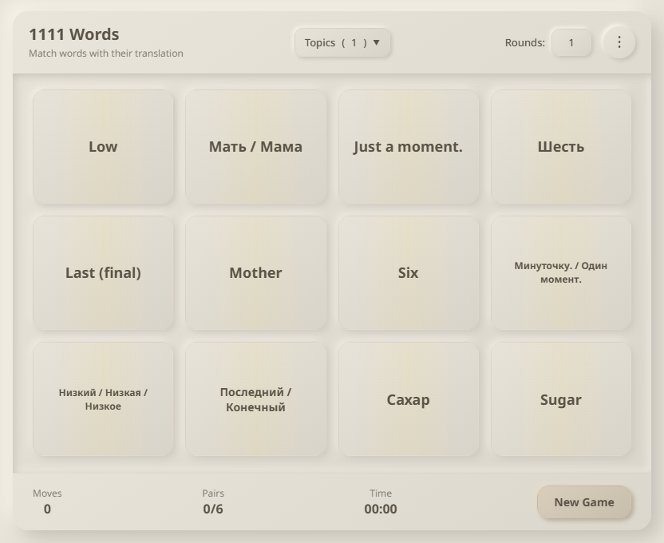
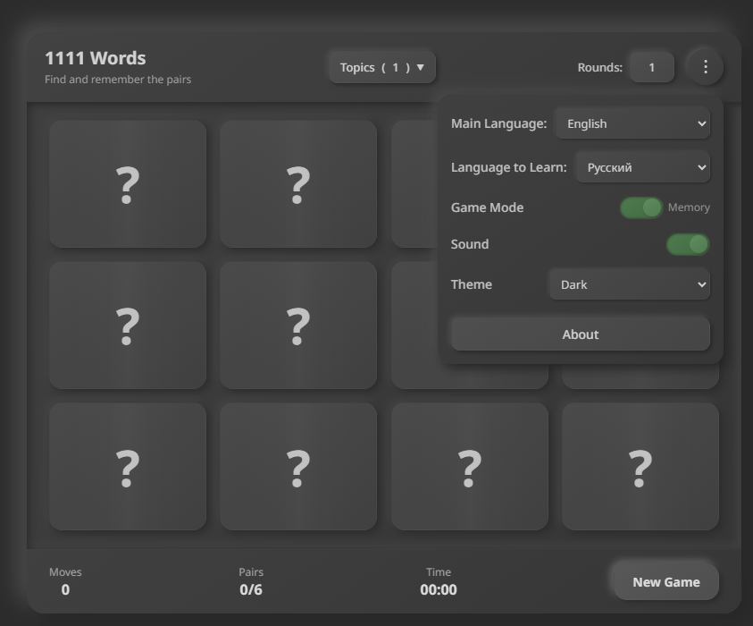
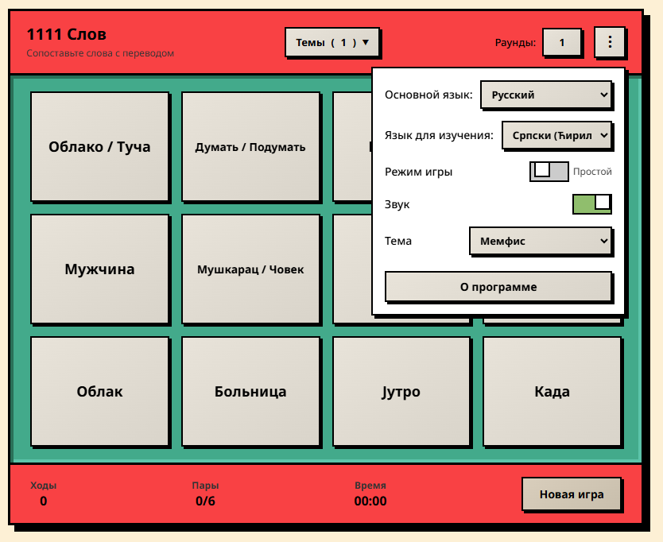

# "1111 Words" Game Series: Learn Languages Easily and Flexibly!
# Серия Игр "1111 Слов": Изучаем Языки Легко и Гибко!

**Play the latest multilingual version live at: [1111words.vovsn.com](http://1111words.vovsn.com)**

**Играйте в последнюю многоязычную версию онлайн: [1111words.vovsn.com](http://1111words.vovsn.com)**

Welcome to a collection of exciting word-matching games designed to help you learn various languages! Our flagship game, **"1111 Words" (multilingual version)**, allows you to choose your native language and the language you want to learn, offering 1111 of the most common words. Classic single-language versions are also available for **Spanish, Serbian, and French**.

Добро пожаловать в коллекцию увлекательных игр на сопоставление слов, созданных для помощи в изучении различных языков! Наша флагманская игра **"1111 Слов" (многоязычная версия)** позволяет вам выбирать родной язык и язык для изучения, предлагая 1111 наиболее употребительных слов. Также доступны классические одноязычные версии для **испанского, сербского и французского** языков.

## 🌟 New: "1111 Words" - Multilingual Game (v0.1.8 alpha, mobile testing ongoing)

## 🌟 Новинка: "1111 Слов" - Многоязычная Игра (v0.1.8 alpha, тестирование на мобильных устройствах продолжается)

Introducing our most flexible and versatile game in the series – **`1111_WORDS.html`**!

Представляем вам нашу самую гибкую и универсальную игру в серии – **`1111_WORDS.html`**!

<!-- Placeholder for Screenshot 1: Main game interface with Light theme -->

  

<!-- /Placeholder -->

This version allows you to:
Эта версия позволяет вам:

*   **Choose Native Language:** Specify the language you will be translating from.
*   **Выбрать Родной Язык:** Укажите язык, с которого вы будете переводить.

*   **Choose Language to Learn:** Specify the language you want to learn.
*   **Выбрать Язык для Изучения:** Укажите язык, который вы хотите выучить.

*   **Available Languages:**
    *   English (en)
    *   Russian (ru)
    *   Spanish (es)
    *   French (fr)
    *   Serbian (Latin - sr_latin)
    *   Serbian (Cyrillic - sr_cyrillic)
*   **Доступные Языки:**
    *   Английский (en)
    *   Русский (ru)
    *   Испанский (es)
    *   Французский (fr)
    *   Сербский (латиница - sr_latin)
    *   Сербский (кириллица - sr_cyrillic)

**Key features of "1111 Words" (multilingual):**
**Ключевые особенности "1111 Слов" (многоязычная):**

*   **Flexible Language Pair Selection:** Learn by translating from any of the supported languages to any other.
*   **Гибкий Выбор Языковой Пары:** Учитесь, переводя с любого из поддерживаемых языков на любой другой.

*   **1111 Words:** A carefully selected vocabulary covering essential topics.
*   **1111 Слов:** Тщательно подобранный словарный запас, охватывающий основные темы.

*   **Word Topics:** Words are grouped by topics (Basics, Food/Restaurants, Travel, Technology/Computers, Business/Economy), allowing you to focus on specific areas.
*   **Темы Слов:** Слова сгруппированы по темам (Основы, Еда/Рестораны, Путешествия, Техника/Компьютеры, Бизнес/Экономика), что позволяет фокусироваться на конкретных областях.

*   **Game Modes:**
    *   **Simple:** Cards are initially face up, making it easier to find pairs – ideal for beginners.
    *   **Memory:** Classic mode where cards are face down, and you need to remember their locations – for memory training and deeper learning.
*   **Режимы Игры:**
    *   **Простой:** Карточки изначально открыты, что облегчает поиск пар – идеально для начинающих.
    *   **Память:** Классический режим, где карточки закрыты, и нужно запоминать их расположение – для тренировки памяти и более глубокого усвоения.

*   **Multiple Rounds:** Option to play 1 to 5 rounds in a row, using new words in each round.
*   **Несколько Раундов:** Возможность играть от 1 до 5 раундов подряд, используя новые слова в каждом раунде.

*   **Responsive Design:** The game looks and works great on computers, tablets, and mobile phones.
*   **Адаптивный Дизайн:** Игра отлично выглядит и работает на компьютерах, планшетах и мобильных телефонах.

<!-- Placeholder for Screenshot 2: Settings menu showing theme selection (e.g., Pixel Quest) -->

  

<!-- /Placeholder -->

*   **Multiple Themes:** Choose your preferred visual style!
    *   **Light (Default):** A clean, bright, and modern neumorphic design.
    *   **Dark:** For comfortable use at any time of day, also with a neumorphic feel.
    *   **Memphis:** A vibrant and playful theme inspired by the Memphis design style, with bold colors and geometric patterns.
    *   **Navy Formal:** A sleek and professional flat design with a light navy and blue color palette.
    *   **Pixel Quest:** A retro 8-bit/16-bit gaming theme with pixelated fonts and blocky aesthetics, featuring larger text for readability.
*   **Разнообразие Тем:** Выберите предпочитаемый визуальный стиль!
    *   **Светлая (По умолчанию):** Чистый, яркий и современный неоморфный дизайн.
    *   **Темная:** Для комфортного использования в любое время суток, также с неоморфным ощущением.
    *   **Мемфис:** Яркая и игривая тема, вдохновленная стилем Мемфис, со смелыми цветами и геометрическими узорами.
    *   **Формальная Темно-синяя:** Элегантный и профессиональный плоский дизайн со светло-синей и темно-синей цветовой палитрой.
    *   **Пиксельный Квест:** Ретро-тема в стиле 8-битных/16-битных игр с пиксельными шрифтами и блочной эстетикой, с увеличенным размером текста для лучшей читаемости.

<!-- Placeholder for Screenshot 3: Game board with a different theme (e.g., Memphis or Dark) -->

  

<!-- /Placeholder -->

*   **Sound Effects:** Pleasant sound accompaniment for in-game actions (can be disabled).
*   **Звуковые Эффекты:** Приятное звуковое сопровождение действий в игре (можно отключить).

*   **Statistics:** Tracking of moves, pairs found, and time spent per round.
*   **Статистика:** Отслеживание ходов, найденных пар и времени, затраченного на раунд.

*   **Serbian Script Support:** Built-in support for Latin and Cyrillic scripts when Serbian is selected.
*   **Поддержка Сербской Письменности:** Встроенная поддержка латиницы и кириллицы при выборе сербского языка.

*   **All in one file:** The game is a **single HTML file** with embedded styles (CSS) and logic (JavaScript). This makes it extremely convenient for sharing via messengers or email – just send the file, and the recipient can play immediately in their browser without needing installation or internet access (after the first download).
*   **Все в одном файле:** Игра представляет собой **один HTML-файл** со встроенными стилями (CSS) и логикой (JavaScript). Это делает ее чрезвычайно удобной для обмена через мессенджеры или электронную почту – просто отправьте файл, и получатель сможет сразу играть в браузере без необходимости установки или доступа в интернет (после первой загрузки).

## 📜 Classic Single-Language Game Versions (v0.1.0)
## 📜 Классические Одноязычные Версии Игр (v0.1.0)

These versions focus on learning one specific language from Russian. Each game also contains 1111 words and a similar set of features (word topics, game modes, rounds, statistics, etc.) but with a simpler theme.
Эти версии фокусируются на изучении одного конкретного языка с русского. Каждая игра также содержит 1111 слов и схожий набор функций (темы слов, режимы игры, раунды, статистика и т.д.), но с более простой темой оформления.

1.  **1111 Spanish Words (`1111_Spanish_words_.html`)**
    *   Learn popular Spanish words and phrases (Russian -> Spanish).
1.  **1111 Испанских Слов (`1111_Spanish_words_.html`)**
    *   Учите популярные испанские слова и выражения (русский -> испанский).

2.  **1111 Serbian Words (`1111_Serbian_words.html`)**
    *   Immerse yourself in the Serbian language (Russian -> Serbian).
    *   Supports switching between Latin and Cyrillic scripts for Serbian words.
2.  **1111 Сербских Слов (`1111_Serbian_words.html`)**
    *   Погрузитесь в сербский язык (русский -> сербский).
    *   Поддерживает переключение между латинским и кириллическим написанием для сербских слов.

3.  **1111 French Words (`1111_French_words.html`)**
    *   Discover the beauty of the French language (Russian -> French).
3.  **1111 Французских Слов (`1111_French_words.html`)**
    *   Откройте для себя красоту французского языка (русский -> французский).

## Technologies
## Технологии

*   HTML5
*   CSS3 (using Flexbox and Grid for layout, multiple themes including Neumorphism, Flat Design, Memphis, and Pixel Art styles)
*   Pure JavaScript (ES6+)
*   Google Fonts (Noto Sans, Pixelify Sans)
*   HTML5
*   CSS3 (с использованием Flexbox и Grid для верстки, несколько тем, включая неоморфизм, плоский дизайн, Мемфис и пиксель-арт стили)
*   Чистый JavaScript (ES6+)
*   Google Fonts (Noto Sans, Pixelify Sans)

## How to Play
## Как Играть

1.  **Go to [1111words.vovsn.com](http://1111words.vovsn.com)** to play the latest multilingual version.
    *   Alternatively, **download the HTML file** of the desired game (e.g., `1111_WORDS.html` for the multilingual version or `1111_Spanish_words_.html` for a classic version).
1.  **Перейдите на [1111words.vovsn.com](http://1111words.vovsn.com)**, чтобы играть в последнюю многоязычную версию.
    *   Либо **скачайте HTML-файл** нужной игры (например, `1111_WORDS.html` для многоязычной версии или `1111_Spanish_words_.html` для классической).

2.  If downloaded, **open the file in any modern web browser** (Google Chrome, Firefox, Safari, Edge, etc.).
2.  Если скачали, **откройте файл в любом современном веб-браузере** (Google Chrome, Firefox, Safari, Edge и т.д.).

3.  **Configure the game:**
    *   **For "1111 Words" (multilingual):** Via the menu (⋮), select your **"Native Language"** and **"Language to Learn"**. Then choose the desired word **topics**, number of **rounds**, **theme**, and other settings.
    *   **For classic versions:** Via the menu (⋮), choose the desired word **topics**, number of **rounds**, and configure other settings.
3.  **Настройте игру:**
    *   **Для "1111 Слов" (многоязычная):** Через меню (⋮) выберите ваш **"Основной язык"** и **"Язык для изучения"**. Затем выберите желаемые **темы** слов, количество **раундов**, **тему оформления** и другие параметры.
    *   **Для классических версий:** Через меню (⋮) выберите желаемые **темы** слов, количество **раундов** и настройте другие параметры.

4.  Click the **"New Game"** button.
4.  Нажмите кнопку **"Новая игра"**.

5.  Find and match words with their translations!
5.  Находите и сопоставляйте слова с их переводами!

## Open Source and Contribution
## Открытый Исходный Код и Участие

This project is **fully Open Source**. We believe in the power of community and invite everyone to contribute!
Этот проект является **полностью открытым (Open Source)**. Мы верим в силу сообщества и приглашаем всех желающих внести свой вклад!

**How you can help:**
**Как вы можете помочь:**

*   **Adding/improving words:** If you notice an error, want to suggest a more accurate translation, or add new relevant words (especially for the multilingual version `1111_WORDS.html`), please do so!
*   **Добавление/улучшение слов:** Если вы заметили ошибку, хотите предложить более точный перевод или добавить новые актуальные слова (особенно для многоязычной версии `1111_WORDS.html`), пожалуйста, сделайте это!

*   **New languages:** Want to add support for a new language in `1111_WORDS.html`? Great!
*   **Новые языки:** Хотите добавить поддержку нового языка в `1111_WORDS.html`? Отлично!

*   **New Themes:** Have an idea for a cool new theme? We'd love to see it!
*   **Новые Темы:** Есть идея для новой крутой темы? Мы будем рады ее увидеть!

*   **Code improvement:** If you have ideas for code optimization, adding new features, or fixing bugs – we welcome your Pull Requests.
*   **Улучшение кода:** Если у вас есть идеи по оптимизации кода, добавлению новых функций или исправлению багов – мы будем рады вашим Pull Request'ам.

*   **Design and UX:** Suggestions for improving the appearance and user experience are always welcome.
*   **Дизайн и UX:** Предложения по улучшению внешнего вида и пользовательского опыта всегда приветствуются.

*   **Testing:** Help us find and fix bugs by playing the games on different devices and in different browsers.
*   **Тестирование:** Помогите нам находить и исправлять ошибки, играя в игры на разных устройствах и в разных браузерах.

*   **Interface localization:** Translating the game interface into other languages.
*   **Локализация интерфейса:** Перевод интерфейса игр на другие языки.

**Where to find the code and how to contribute:**
**Где найти код и как внести вклад:**

*   **GitHub Repository:** [https://github.com/VOVSn/1111-words](https://github.com/VOVSn/1111-words)
    *   Main multilingual game: `1111_WORDS.html`
    *   Classic versions: `1111_Spanish_words.html`, `1111_Serbian_words.html`, `1111_French_words.html`
*   **GitHub Репозиторий:** [https://github.com/VOVSn/1111-words](https://github.com/VOVSn/1111-words)
    *   Основная многоязычная игра: `1111_WORDS.html`
    *   Классические версии: `1111_Spanish_words.html`, `1111_Serbian_words.html`, `1111_French_words.html`

*   **How to contribute:**
    1.  Fork the repository.
    2.  Create a new branch for your changes (`git checkout -b feature/your-feature` or `bugfix/bug-fix`).
    3.  Make your changes.
    4.  Commit your changes (`git commit -m 'Brief description of changes'`).
    5.  Push your changes to your fork (`git push origin feature/your-feature`).
    6.  Create a Pull Request to the main repository.
*   **Как контрибьютить:**
    1.  Сделайте форк репозитория.
    2.  Создайте новую ветку для своих изменений (`git checkout -b feature/ваша-фича` или `bugfix/исправление-бага`).
    3.  Внесите свои изменения.
    4.  Сделайте коммит (`git commit -m 'Краткое описание изменений'`).
    5.  Отправьте изменения в свой форк (`git push origin feature/ваша-фича`).
    6.  Создайте Pull Request в основной репозиторий.

Let's make language learning more accessible and engaging together!
Давайте вместе сделаем изучение языков доступнее и увлекательнее!

---

Author: VOVSN ([https://github.com/VOVSn](https://github.com/VOVSn))